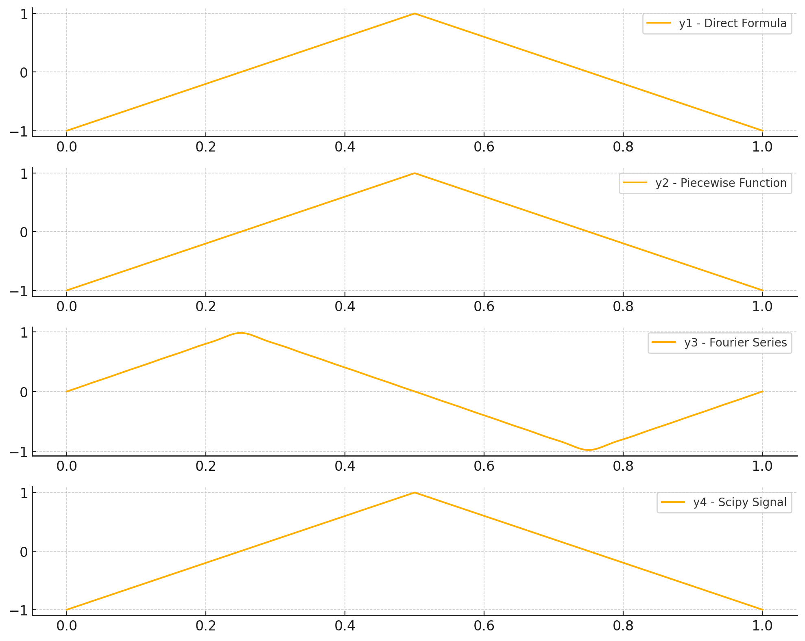

# 代码
使用Python中的timeit库来测量执行时间，并分别实现y1、y2、y3、y4四种不同方法计算三角波
```python
import numpy as np
import timeit
import matplotlib.pyplot as plt

# 定义三角波生成的基础参数
t = np.linspace(0, 1, 1000)  # 时间范围
T = 1  # 三角波周期

# 方法1：使用直接公式
def triangle_wave_y1(t, T):
    return 2 * np.abs(2 * (t / T - np.floor(t / T + 0.5))) - 1

# 方法2：使用分段函数
def triangle_wave_y2(t, T):
    return np.where(t < T/2, 4*t/T - 1, -4*t/T + 3)

# 方法3：傅里叶级数展开计算三角波
def triangle_wave_y3(t, T, n_terms=10):
    y = np.zeros_like(t)
    for n in range(1, n_terms+1):
        y += (-1)**(n-1) * (np.sin(2 * np.pi * (2 * n - 1) * t / T) / (2 * n - 1)**2)
    return (8 / np.pi**2) * y

# 方法4：利用信号处理库scipy.signal的函数
from scipy import signal

def triangle_wave_y4(t, T):
    return signal.sawtooth(2 * np.pi * t / T, 0.5)

# 定义测量执行时间的函数
def measure_time(func, *args):
    setup_code = f"from __main__ import {func.__name__}"
    stmt = f"{func.__name__}(*{args})"
    return timeit.timeit(stmt=stmt, setup=setup_code, number=1000)

# 测算并比较四种方法的速度
time_y1 = measure_time(triangle_wave_y1, t, T)
time_y2 = measure_time(triangle_wave_y2, t, T)
time_y3 = measure_time(triangle_wave_y3, t, T, 10)
time_y4 = measure_time(triangle_wave_y4, t, T)

# 计算结果
y1 = triangle_wave_y1(t, T)
y2 = triangle_wave_y2(t, T)
y3 = triangle_wave_y3(t, T)
y4 = triangle_wave_y4(t, T)

# 打印计算时间
print(f"Method 1 (y1) Time: {time_y1:.6f} seconds")
print(f"Method 2 (y2) Time: {time_y2:.6f} seconds")
print(f"Method 3 (y3) Time: {time_y3:.6f} seconds")
print(f"Method 4 (y4) Time: {time_y4:.6f} seconds")

# 绘制四种方法的比较
plt.figure(figsize=(10, 8))

plt.subplot(4, 1, 1)
plt.plot(t, y1, label="y1 - Direct Formula")
plt.legend()

plt.subplot(4, 1, 2)
plt.plot(t, y2, label="y2 - Piecewise Function")
plt.legend()

plt.subplot(4, 1, 3)
plt.plot(t, y3, label="y3 - Fourier Series")
plt.legend()

plt.subplot(4, 1, 4)
plt.plot(t, y4, label="y4 - Scipy Signal")
plt.legend()

plt.tight_layout()
plt.show()
```
# 结果

